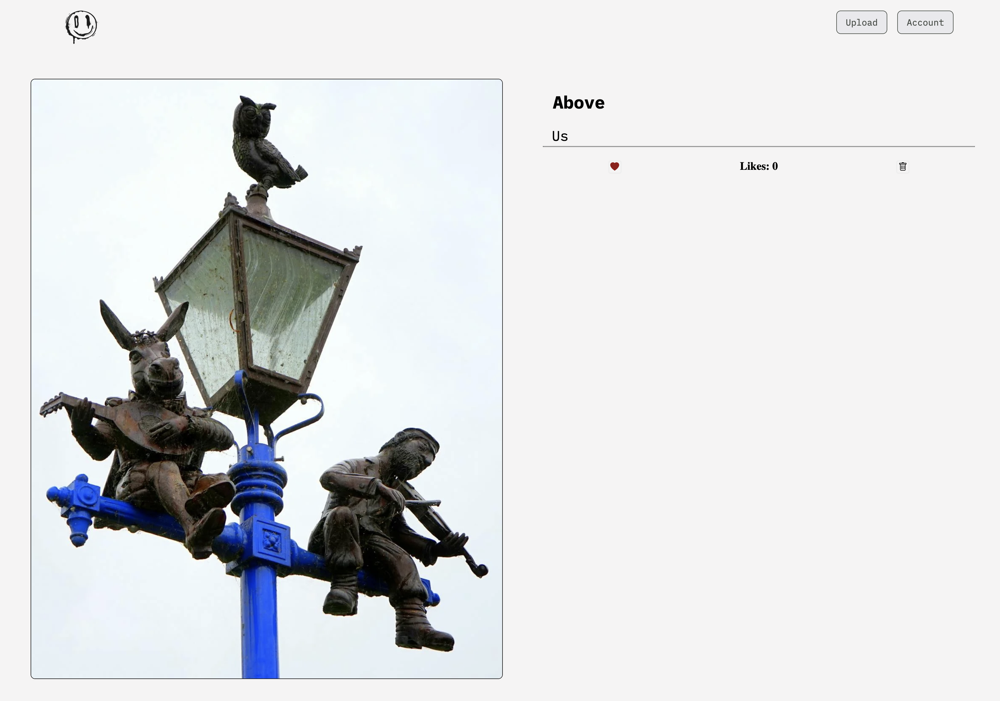

<h1 align="center" id="title">Seen</h1>

<p id="description">Seen is a photography-focused social media that allows users to upload original photos of artworks they have seen in real life. The goal of the app is to archive art that holds a physical presence in a public location. The philosophy of seen is that an artwork's value should not be based on its location author or academic opinion.</p>

<h2>Project Screenshots:</h2>




<h2>🛠️ Installation Steps:</h2>

<p>1. Install</p>

```
npm install
```

<p>2. Set up data base</p>

```
config/database.js
```

<p>3. Set up image data base</p>

```
middleware/cloudinary.js
```

<p>4. Create .env file</p>

```
DB_KEY:"yourkey";
```

  
  
<h2>💻 Built with</h2>

Technologies used in the project:

*   EJS
*   Javascript
*   Node.js
*   Express
*   Passport
*   MongoDB
*   Cloudinary

<h2>🛡️ License:</h2>

<a href="https://opensource.org/license/mit">MIT</a> License